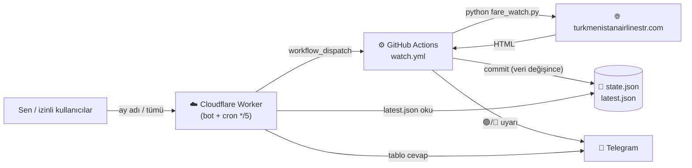

# TK Fare-Watch — Tam Dokümantasyon

Aşgabat → İstanbul (Turkmenistan Airlines) uçak bileti izleme + Telegram bot sistemi.
Bu dosya **ne olduğunu, nasıl çalıştığını ve nasıl değiştireceğini** blok blok anlatır.

## İçindekiler
1. [Ne işe yarar](#1-ne-işe-yarar)
2. [Nasıl çalışır (mimari)](#2-nasıl-çalışır-mimari)
3. [Kavramlar sözlüğü (git, GitHub, Cloudflare…)](#3-kavramlar-sözlüğü)
4. [Bloklar (parçalar)](#4-bloklar)
5. [Gizli değerler (secrets) nerede](#5-gizli-değerler-secrets)
6. [Değişiklik rehberi — blok blok](#6-değişiklik-rehberi--blok-blok)
7. [Sık kullanılan komutlar](#7-sık-kullanılan-komutlar)
8. [Sorun giderme](#8-sorun-giderme)
9. [Bakım](#9-bakım)

---

## 1. Ne işe yarar

- **turkmenistanairlinestr.com** (Turkmenistan Airlines'ın resmî Türkiye acentesi) üzerinden
  **Aşgabat (ASB) → İstanbul (IST)** ekonomi/business fiyatlarını **her 5 dakikada** tarar.
- **Telegram'a** otomatik bildirim atar: 🟢 yeni bilet çıkınca, 🔻 fiyat düşünce.
- Bota **ay adı** (`eylül`) ya da `tümü` yazınca o ayın biletlerini tablo halinde gösterir.
- İzleme aralığı: **1 Ağustos – 31 Ekim 2026** (bugünden ileriye).
- Tamamen **ücretsiz** çalışır (GitHub public repo + Cloudflare ücretsiz katman).

> Not: Ana `turkmenistanairlines.tm` sitesi uluslararası bileti sadece CAPTCHA'lı satıyor; bu yüzden
> fiyatlar resmî Türkiye acentesi sitesinden alınır.

---

## 2. Nasıl çalışır (mimari)



**Akışın özeti:**
1. **Cloudflare Worker'ın cron'u** her 5 dk'da GitHub'daki tarama işini tetikler (güvenilir zamanlama).
2. **GitHub Actions**, `fare_watch.py`'yi çalıştırır: siteyi tarar, fiyatları çıkarır.
3. Önceki durumla (`state.json`) karşılaştırır; **değişiklik varsa** Telegram'a uyarı atar ve
   `state.json` + `latest.json`'u repoya commit'ler.
4. **Bot** (aynı Worker), sen ay adı yazınca `latest.json`'u okuyup tabloyu Telegram'a gönderir.

**Neden iki ayrı sistem (GitHub + Cloudflare)?**
GitHub Actions taramayı (Python + `curl_cffi`) ücretsiz ve kolay çalıştırır ama **zamanlaması güvenilmezdir**
(bazen saatler atlar). Cloudflare cron ise dakikası dakikasına çalışır — o yüzden **tetikleyici** olarak onu
kullanıyoruz, **işi** ise GitHub yapıyor.

---

## 3. Kavramlar sözlüğü

| Terim | Kısaca ne demek |
|-------|-----------------|
| **git** | Dosya değişikliklerini kaydeden/versiyonlayan araç (bilgisayarında çalışır). |
| **GitHub** | git depolarını internette barındıran site. Kodun burada: `github.com/emelian293/tk-fare-watch`. |
| **repo (depo)** | Projenin dosyalarının tutulduğu yer. Bizimki **public** (herkese açık) olmalı. |
| **commit** | Bir değişikliği "kaydet" işlemi (mesajıyla birlikte). |
| **push / pull** | Yerel değişikliği GitHub'a gönder (push) / GitHub'dakini indir (pull). |
| **GitHub Actions** | GitHub'ın bulutunda kod çalıştıran sistem. `watch.yml` bunu tanımlar. |
| **workflow / watch.yml** | Actions'ın ne yapacağını yazan tarif dosyası (`.github/workflows/`). |
| **cron** | "Şu aralıklarla çalıştır" zamanlaması. Örn. `*/5 * * * *` = her 5 dakikada. |
| **workflow_dispatch** | Bir workflow'u dışarıdan/elle tetikleme yöntemi (Cloudflare bunu kullanır). |
| **secret** | Gizli değer (token, şifre). Koda yazılmaz; GitHub/Cloudflare panelinde şifreli durur. |
| **Cloudflare** | Bulut altyapı firması. Bizde **Worker** ve **cron** için kullanılır. |
| **Worker** | Cloudflare'de çalışan küçük bir program (bizim bot + zamanlayıcı). |
| **wrangler** | Worker'ı bilgisayardan yükleme/deploy etme aracı (`npx wrangler ...`). |
| **KV** | Cloudflare'in küçük veritabanı. Bizde **izinli kullanıcı listesi** burada. |
| **webhook** | Telegram'ın, sana mesaj gelince Worker'ı haberdar etmesi (bir URL'e POST atar). |
| **PAT (token)** | "Personal Access Token" — GitHub API'sine erişim anahtarı (Cloudflare'in tarama tetiklemesi için). |
| **gh** | GitHub'ın komut satırı aracı (`gh run list` gibi). |

---

## 4. Bloklar

### 🅐 Veri kaynağı — turkmenistanairlinestr.com
- Fiyatlar şu adresten okunur:
  `…/tr-TR/SearchResult/ASB/IST/GG.AA.YYYY/-/false/false/1/0/0/1`
- Site **Cloudflare korumalı**. Düz istek `403` yer; bu yüzden `curl_cffi` (Chrome taklidi) kullanılır.
- Kırılganlık: site HTML'ini değiştirirse `fare_watch.py` içindeki `parse_fares` güncellenmelidir.

### 🅑 Tarama scripti — `fare_watch.py`
Python. Yaptığı iş: tarihleri paralel tara → fiyatları çıkar → önceki durumla karşılaştır → Telegram + kaydet.
- **Ayarlar** dosyanın başında (`# AYARLAR` bölümü): `ORIGIN`, `DEST`, `DATE_START`, `DATE_END`, `MAX_WORKERS`.
- **Önemli fonksiyonlar:**
  - `fetch_date()` — bir tarihin sayfasını çeker (`ok` / `empty` / `fail`).
  - `parse_fares()` — HTML'den uçuş·saat·sınıf·fiyat·koltuk çıkarır.
  - `run_once()` — tüm akış: tara, karşılaştır, bildir, `state.json` + `latest.json` yaz.
  - `full_report_messages()` / `_month_table()` — tam liste tablosu.
- **Bayraklar:** `--report` (tam liste gönder), `--dry-run` (deneme, göndermez/yazmaz), `--date GG.AA.YYYY`, `--limit N`.

### 🅒 GitHub repo + Actions — `.github/workflows/watch.yml`
- Her tetiklemede: Python'u kurar → `fare_watch.py` çalıştırır → `state.json`/`latest.json` **değiştiyse** commit'ler.
- İki tetikleyici: `schedule` (`*/10`, yedek) + `workflow_dispatch` (Cloudflare'in kullandığı; `report` girdili).
- `state.json` = son bilinen fiyatlar (değişiklik tespiti için). `latest.json` = botun okuduğu güncel tablo verisi.

### 🅓 Cloudflare Worker — `worker/src/index.js`
İki görevi var:
1. **Bot (webhook):** Telegram'dan mesaj gelince cevaplar (ay tablosu, izin komutları).
2. **Cron (`*/5`):** her 5 dk'da GitHub taramasını `workflow_dispatch` ile tetikler (`triggerScan`).
- Ayarı: `worker/wrangler.toml` (isim, KV bağlantısı, cron).
- Yükleme: `cd worker && npx wrangler deploy`.

### 🅔 Telegram
- **Bot token** BotFather'dan alındı. İki yerde kullanılır: GitHub (uyarı gönderir) + Cloudflare (cevap verir).
- Uyarılar `TELEGRAM_CHAT_ID`'ye gider; bot cevapları mesajı atan kişiye gider.

### 🅕 KV (erişim listesi) — `ACCESS`
- İzinli kullanıcı ID'leri burada (`u:<id>` anahtarlarıyla).
- Yönetim Telegram'dan: `/izinver <id> [ad]`, `/izinal <id>`, `/kullanicilar`.

---

## 5. Gizli değerler (secrets)

| Değer | Nerede | Ne işe yarar |
|-------|--------|--------------|
| `TELEGRAM_TOKEN` | GitHub → Settings → Secrets → Actions | Actions'ın uyarı göndermesi |
| `TELEGRAM_CHAT_ID` | GitHub Secrets | Uyarının gideceği sohbet |
| `BOT_TOKEN` | Cloudflare Worker (wrangler secret) | Botun cevap vermesi |
| `OWNER_CHAT_ID` | Cloudflare Worker | Sahip (yönetici) = `676296383` |
| `WEBHOOK_SECRET` | Cloudflare Worker | Webhook güvenliği (Telegram ile aynı) |
| `GH_TOKEN` | Cloudflare Worker | Cloudflare'in GitHub taramasını tetiklemesi (PAT) |
| KV namespace `ACCESS` | Cloudflare (wrangler.toml `id`) | İzinli kullanıcı listesi |

> **Kural:** Bunlar koda **yazılmaz**. GitHub secret eklemek: `gh secret set AD`. Worker secret: `npx wrangler secret put AD`.

---

## 6. Değişiklik rehberi — blok blok

> **Her kod değişikliğinden sonra genel akış** (repo için):
> ```bash
> cd "/Users/sohbet/Desktop/tk-fare-watch"
> # ... dosyayı düzenle ...
> git add .
> git commit -m "ne değiştirdin yaz"
> git pull --no-rebase --no-edit   # botun state commit'leriyle senkron ol
> git push
> ```
> **Worker (bot) değişikliğinden sonra ayrıca:**
> ```bash
> cd "/Users/sohbet/Desktop/tk-fare-watch/worker" && npx wrangler deploy
> ```

### ➊ Tarih aralığını değiştir (örn. 2027'ye uzat)
Dosya: `fare_watch.py` → `# AYARLAR`:
```python
DATE_START = date(2026, 8, 1)
DATE_END   = date(2026, 10, 31)   # örn. date(2027, 3, 31) yap
```
Sonra: repo akışı (commit + push). Worker'a dokunmaya gerek yok.

### ➋ Tarama sıklığını değiştir (örn. 10 dk yap)
Dosya: `worker/wrangler.toml`:
```toml
[triggers]
crons = ["*/5 * * * *"]   # örn. "*/10 * * * *"
```
Sonra: `cd worker && npx wrangler deploy`.

### ➌ Rotayı değiştir / dönüş yönü ekle (örn. İstanbul→Aşgabat)
Dosya: `fare_watch.py` → `ORIGIN` / `DEST` (`"ASB"` / `"IST"`).
Not: iki yönü **aynı anda** izlemek kod eklemesi gerektirir — bunu istersen ayrıca yaparız.

### ➍ Mesaj/tablo görünümünü değiştir
- Otomatik uyarılar ve tam liste: `fare_watch.py` içinde `_new_avail_message`, `_price_drop_message`, `_month_table`.
- Botun cevabı: `worker/src/index.js` içinde `monthTable`, `helpText`. (Worker değişince `wrangler deploy`.)

### ➎ Telegram bot token'ını yenile
BotFather → `/revoke` → yeni token. Sonra **iki yeri de** güncelle:
```bash
gh secret set TELEGRAM_TOKEN -R emelian293/tk-fare-watch     # GitHub
cd "/Users/sohbet/Desktop/tk-fare-watch/worker" && npx wrangler secret put BOT_TOKEN   # Cloudflare
```

### ➏ Erişim (paylaşım) yönet
Telegram'da (sahip olarak): `/izinver <id> [ad]` · `/izinal <id>` · `/kullanicilar`.
Kişi bota yazınca ID'sini görür + sana istek bildirimi düşer.

### ➐ GitHub token'ını yenile (süresi dolunca)
GitHub → Settings → Developer settings → Fine-grained tokens → yeni token (repo: tk-fare-watch, **Actions: Read and write**). Sonra:
```bash
cd "/Users/sohbet/Desktop/tk-fare-watch/worker" && npx wrangler secret put GH_TOKEN
```

---

## 7. Sık kullanılan komutlar

```bash
# --- Proje klasörü ---
cd "/Users/sohbet/Desktop/tk-fare-watch"

# Değişiklikleri gönder
git add . && git commit -m "mesaj" && git pull --no-rebase --no-edit && git push

# Son taramaları gör
gh run list --workflow=watch.yml -R emelian293/tk-fare-watch --limit 8

# Bir taramanın loguna bak
gh run view <RUN_ID> --log -R emelian293/tk-fare-watch

# Elle tam liste tetikle
gh workflow run watch.yml -R emelian293/tk-fare-watch -f report=true

# --- Worker (bot) ---
cd worker
npx wrangler deploy                       # botu güncelle
npx wrangler secret put <AD>              # gizli değer ekle/güncelle
npx wrangler tail                          # botun canlı loglarını izle
```

---

## 8. Sorun giderme

| Belirti | Olası sebep | Ne yap |
|---------|-------------|--------|
| Hiç uyarı gelmiyor, liste boş | Site HTML'i değişti (parser bozuldu) veya erişim engellendi | `gh run view <id> --log` ile bak; `parse_fares` güncellenmeli |
| "⚠️ Tarama tetiklenemedi" mesajı | GitHub token süresi doldu | Rehber ➐: yeni `GH_TOKEN` |
| Bot cevap vermiyor | Webhook koptu veya BOT_TOKEN değişti | `getWebhookInfo` kontrol; secret'ları doğrula |
| Actions kırmızı (hata) | Kod hatası / bağımlılık | Run log'una bak |
| Bot "0 bilet" diyor ama olması lazım | Parser/site sorunu veya gerçekten dolu | Siteyi elle kontrol et |

Webhook durumu:
```bash
curl "https://api.telegram.org/bot<BOT_TOKEN>/getWebhookInfo"
```

---

## 9. Bakım

- 🔑 **GitHub token'ı** süresi dolunca yenile (Rehber ➐). Dolarsa Cloudflare sana uyarı atar.
- 🌍 **Repo public kalmalı** — private yaparsan hem Actions ücretli sınıra takılır hem bot `latest.json`'u okuyamaz.
- 📅 **31 Ekim 2026'dan sonra** sistem boşa döner (aralık biter); 2027 için `DATE_END`'i büyüt (Rehber ➊).
- 💸 Maliyet: **0** (public repo sınırsız Actions + Cloudflare ücretsiz katman).

---

### Dosya haritası
```
tk-fare-watch/
├── fare_watch.py            # tarama scripti (Python)
├── requirements.txt         # Python bağımlılıkları
├── state.json               # son bilinen fiyatlar (değişiklik tespiti)
├── latest.json              # botun okuduğu güncel tablo verisi
├── get_chat_id.py           # Telegram chat_id bulucu (yardımcı)
├── README.md                # kısa kurulum
├── DOKUMANTASYON.md         # bu dosya
├── .github/workflows/
│   └── watch.yml            # GitHub Actions tarif
└── worker/
    ├── src/index.js         # Cloudflare Worker (bot + cron)
    ├── wrangler.toml        # Worker ayarı (KV + cron)
    └── README.md            # Worker kurulum
```
